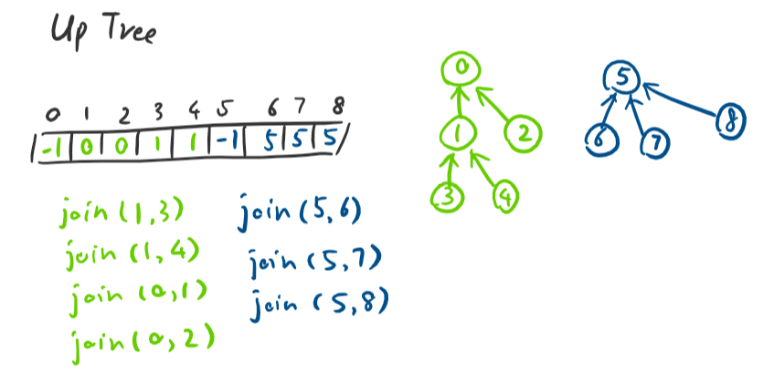

## Definition
- Maintain a collection S = {s0, s1, s2, ..., sk}
- Each set has a representative number (identity)
- API:
    ```c++
    void makeSet(const T & t);
    void set_union(const T & k1, const T & k2);
    T & find(const T &k);
    ```
- In other literature in computer science, you'll notice that the "disjoint sets" data structure is also sometimes referred to as the "union-find" data structure, because of its primary methods, "union" and "find"
- In C and C++, the word "union" is reserved for a specific language feature, so you can't use "union" as a name for a variable or function. Instead you have to use a variant such as "set_union" and so on.

## Implementation
- If we store all elements in an array - Element is the index of the array and the value in that index is the identity/representative memeber of the set
    - Find will have runtime of O(1)
    - Union will take runtime of O(n) because we have to find every element corresponding to a identity/representative member
- Uptrees
    - Continue with array where index is the key
    - Store -1 if element in same index, else store the index (identity) where element is as the value in the array
    - For union, point the root node to the root node of the set with which to merge

        
- Optimizing runtime
    - Worst case run time is proportional to the height of the tree. E.g. if single linked list (height=n) will mean O(n). Ideal case: one root node and all other elements are children of the one root!!
    - Union strategies
        - Union by height: Idea is to keep height of the tree as small as possible. Storing height of root node as negative value (instead of -1, store -height)
        - Union by size: Idea is to minimize the number of nodes that increase in height. 
        - Both these algos ensure height is log(n)
    - Optimize find
        - Path compression: point all the nodes to root node so that we don't have to traverse the entire tree to find the root node - go close to O(1)
- What's the runtime of disjoint sets? - iterated log(n) - number of times you can take a log of a number. E.g. iterated log(2^65k) = 5, because after 5 log() operations, we get 0. So it's almost constant time (O(1)). Amortized it's O(1)


