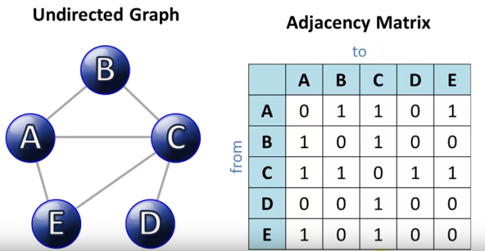
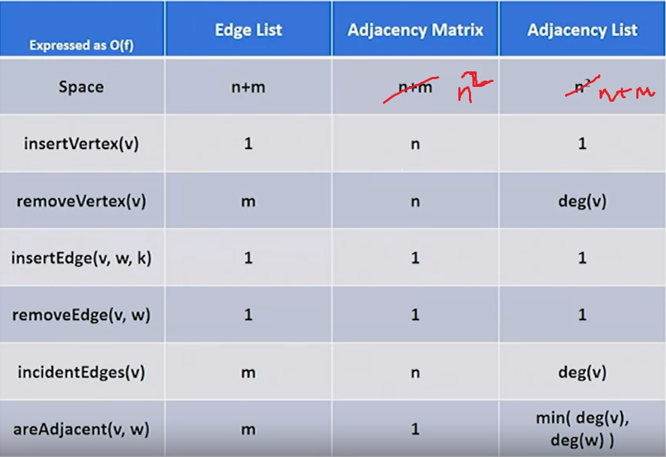

### Data to be stored
- Sequence of vertices
- Sequence of edges
- Relationship between edges and vertices

### Edge list implementation
- List of vertices: E.g. [u, v, w, ...] (hash table)
- Edge list: E.g. [[u, v, a], [v, w, b], ...] where a and b are edge values
- If insert vertex - add to end of vertex list - amortized O(1)
- Remove vertex: O(1) to remove the vertex itself and total O(m) to remove all edges associated with the vertex
- areAdjacent: need to go through entire list of edges to check if 2 vertices are adjacent O(m) time
- incidentEdges: need to go through entire list of edges to check all edges that are incident to a given vertex, O(m) time

### Adjacency matrix
- Store vertex list, edge list and a matrix with pointer to each edge as shown below

- Runtimes
    - InsertVertex: O(1) insert in the list, but add a row and column to the matrix as well - thus O(n) (need to add for each existing vertex)
    - RemoveVertex: same as above: O(n)
    - areAdjacent: extremely fast to index this: O(1)
    - incidentEdges: look at entire row and column for a vertex i.e. 2n checks - O(n)

### Adjacency list implementation
- Combining both the above
- Vertex list impl as hash table
- + include linked list pointing to the edges, edge list also links back to the vertices
- becomes a little messy
- Runtime
    - Insert: O(1)
    - removeVertex: O(deg(V)) - remove all the edges
    - areAdjacent: min (deg(V1), deg(V2)) - good runtime but not as good as adjacency matrix runtime
    - incidentEdges: deg(v)

### Summary

### Use case questions
- Suppose you have a rapid data feed that requires you to add new data point vertices quickly to a graph representation. Which graph representation would you NOT want to utilize?
    - The adjacency matrix requires linear time, O(n), to add a vertex because the addition requires new entries to be placed in a new row and a new column of the matrix, and there are n elements in the new row and n elements in the new column. This means that as the number of vertices grows in the graph, it will take longer to add a new vertex, which is not a very good choice when processing a data feed.
- Suppose you have a rapid data feed that requires you to remove existing data point vertices (and any of their edges to other vertices) quickly to a graph representation. Which graph representation would you WANT to utilize?
    - Since the adjacency list has a list of the edges the removed vertex shares with other vertices, it only needs time proportional to the degree of the removed vertex. In the worst case, that vertex could be connected to all of the other vertices and so require O(n) time, but in the typical case the degree will be less and the adjacency list is a better choice than the adjacency matrix.
- Suppose you want to implement a function called neighbors(v) that returns the list of vertices that share an edge with vertex v. Which representation would be the better choice for implementing this neighbors() function?
    - The adjacency list requires a simple walk through the list of pointers to adjacent edges to find the neighboring vertices. This representation has an "output sensitive" running time meaning it runs as fast as possible based on the minimum amount of time needed to output the result.
- Suppose you want to implement a function called neighborsQ(v1,v2) that returns true only if vertices v1 and v2 share an edge. Which representation would be the better choice for implementing this neighborsQ() function?
    - The neighborsQ(v1,v2) function can simply lookup the appropriate v1,v2 entry in the adjacency matrix, which takes constant O(1) time. This representation supports the fastest method for implementing this query.
- Which graph representation would be the best choice for implementing a procedure that only needs to build a graph from a stream of events.
    - The Edge List performs worse in general than the Adjacency Matrix and the Adjacency List representations, but it is much simpler and easier to implement. It also takes less space than the alternatives, and can insert vertices and edges in constant time. The adjacency list can also insert vertices and edges in constant time, but if those are the only operations needed, then one need not waste space and additional code on building the adjacency list on top of the edge list.
